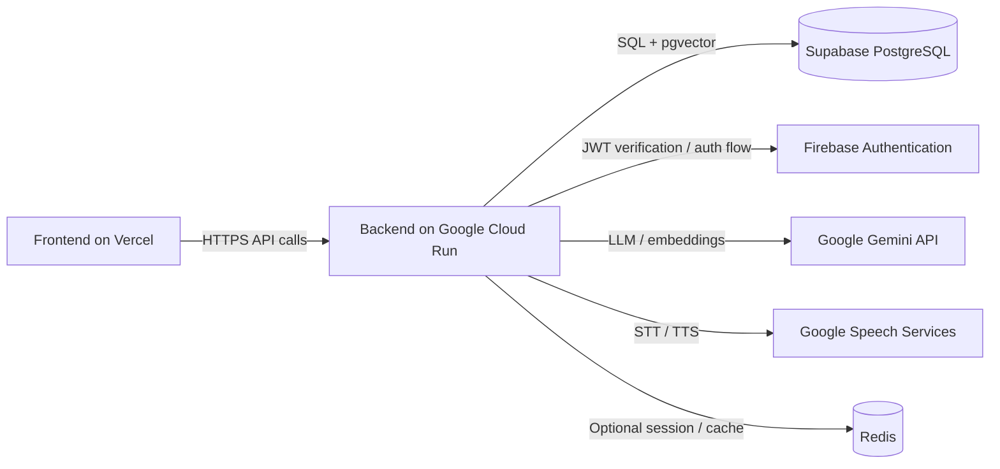

# Shiftify

## Deployment Architecture



### Production Stack

- Frontend: Vercel
- Backend: Google Cloud Run
- Database: Supabase PostgreSQL with `pgvector`
- Auth: Firebase Authentication
- AI: Google Gemini API
- Speech: Google Cloud Speech-to-Text and Text-to-Speech

### Frontend Integration

The frontend must point to the backend API through `VITE_API_URL`:

```env
VITE_API_URL=https://api.your-domain.com/api
```

The shared axios client in the frontend already reads this value, so the UI can call the backend directly without any extra proxy layer.

### API Surface

- Base API path: `/api`
- Health check: `GET /health`
- Readiness check: `GET /ready`
- Swagger: `/docs`

### Deployment Checklist

#### Cloud Run

1. Build the backend image from `backend/Dockerfile`.
2. Deploy the container to Cloud Run in `asia-southeast1`.
3. Set `TRUST_PROXY=true` because Cloud Run sits behind Google’s load balancer.
4. Set `API_PUBLIC_URL` to the public backend URL.
5. Set `FRONTEND_URL` and `CORS_ORIGINS` to the deployed Vercel domain(s).
6. Set `DATABASE_URL` to the Supabase PostgreSQL connection string, or keep the existing `DB_*` variables if the app is using split config.
7. Configure `JWT_SECRET` and `JWT_REFRESH_SECRET`.
8. Configure `GEMINI_API_KEY`, `GOOGLE_APPLICATION_CREDENTIALS`, and any speech-related credentials needed by the runtime.
9. Verify `/health`, `/ready`, `/docs`, and one protected endpoint after deploy.
10. If the app will move to Firebase Authentication, update the backend auth guard to verify Firebase ID tokens before switching the frontend login flow.
11. If the app will move speech to Google Cloud Speech services, replace the current speech provider wiring in `backend/src/core/ai/agents/shared/stt.js` and `tts.js`.
12. On Cloud Run, prefer service identity and Secret Manager over setting `GOOGLE_APPLICATION_CREDENTIALS` as a plain environment variable.

#### Supabase

1. Create the Supabase project.
2. Enable PostgreSQL extensions needed by the app, especially `pgvector` if the AI matching flow uses embeddings.
3. Apply the backend migrations against the production database.
4. Verify the connection string is reachable from Cloud Run.
5. Keep storage, row-level security, and auth settings aligned with the app’s access model if Supabase Auth or storage is used later.

#### Firebase Authentication

1. Create the Firebase project.
2. Enable the providers required by the product.
3. Export the Firebase client config to the frontend.
4. Use Firebase tokens in the frontend if the auth flow is migrated from JWT login.
5. Keep backend verification logic in sync with the chosen auth contract.

### What Is Still Missing In Code

The repo is deployment-ready in structure, but a few production integrations are still configuration or migration work rather than fully wired product code:

- Firebase Auth verification is not yet enforced in the backend request pipeline.
- Google Cloud Speech-to-Text and Text-to-Speech are not yet the default runtime path.
- Supabase is still the database target by deployment contract, but the codebase currently uses the existing Knex/PostgreSQL setup and needs the production connection values wired in.
- The Cloud Run workflow assumes secrets are already created in GitHub and Artifact Registry exists in GCP.
- The backend service should be smoke-tested after deploy against `/health`, `/ready`, `/docs`, auth, and one write endpoint.

### Reference Sources

- Cloud Run environment variables and secrets: [Google Cloud docs](https://cloud.google.com/run/docs/configuring/services/environment-variables)
- Firebase ID token verification: [Firebase docs](https://firebase.google.com/docs/auth/admin/verify-id-tokens)
- Firebase Admin Auth overview: [Firebase docs](https://firebase.google.com/docs/auth/admin)
- Supabase pgvector: [Supabase docs](https://supabase.com/docs/guides/database/extensions/pgvector)
- Supabase extensions overview: [Supabase docs](https://supabase.com/docs/guides/database/extensions)

### CI/CD Skeleton

The repo now supports a Cloud Run deploy flow through GitHub Actions and Cloud Build.

- GitHub Actions path: `backend/.github/workflows/deploy.yml`
- Cloud Build path: `backend/cloudbuild.yaml`

Use the GitHub Actions flow for `main` deploys, and keep Cloud Build as an alternate build/deploy entrypoint if the team prefers GCP-native releases.

### Notes For The FE Team

- Always call the backend with the full `/api` prefix.
- Do not hardcode localhost in production builds.
- Use the same `VITE_API_URL` for all request clients so auth refresh and uploads stay aligned.
